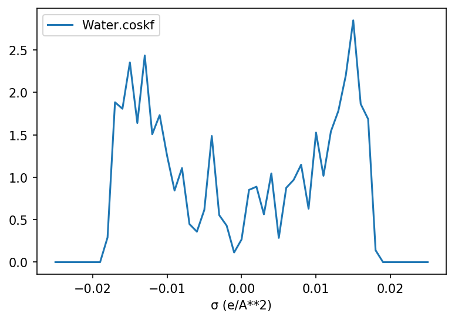

COSMO-RS
--------

(*contributed by* `Bas van Beek <https://www.researchgate.net/profile/Bas_van_Beek>`_\)

.. currentmodule:: scm.plams.interfaces.adfsuite.crs

COSMO-RS can be run from PLAMS using the |CRSJOb| class and the corresponding |CRSResults|,
both respectivelly being subclasses of |SCMJob| and |SCMResults|.

.. note:: There is also `a tutorial showing full code examples <../../COSMO-RS/PLAMS_COSMO-RS_scripting.html>`__ available in the COSMO-RS documentation.  There are several templates available that can easily be customized for other problem types, workflows, etc.

Settings
~~~~~~~~

For example, considering the following input file for a COSMO-RS
sigma-profile calculation [`1 <../../COSMO-RS/Analysis.html#sigma-profile>`_]:

.. code::

    compound /path/to/file.t21
        frac1 1.0
    end

    property puresigmaprofile
        nprofile 50
        pure
        sigmamax 0.025
    end

    temperature 298.15

The input file displayed above corresponds to the following settings:

.. code:: python

    >>> from scm.plams import Settings, CRSJob

    >>> s = Settings()

    >>> s.input.compound._h = '/path/to/file.t21'
    >>> s.input.compound.frac1 = 1.0
    >>> s.input.property._h = 'puresigmaprofile'
    >>> s.input.property.nprofile = 50
    >>> s.input.property.sigmamax = 0.025
    >>> s.input.property.pure = ''
    >>> s.input.temperature = 298.15

    >>> my_job = CRSJob(settings=s)
    >>> my_results = my_job.run()

Alternatively one can create a :class:`CRSJob` instance from a runscript created by,
for example, the ADF GUI (``File -> Save as``).

.. code:: python

    >>> from scm.plams import CRSJob

    >>> filename = 'path/to/my/crs/inputfile.run'
    >>> my_job = CRSJob.from_inputfile(filename)
    >>> my_results = my_job.run()

Settings with multiple compound
~~~~~~~~~~~~~~~~~~~~~~~~~~~~~~~

More often than not one is interested in the properties of
multi-component mixtures (*e.g.* a dissolved solute).
In such cases one has to pass multiple ``compound`` blocks to
the input file, which is somewhat problematic as Python dictionaries
(including |Settings|) can only contain a set of unique keys.

This problem can be resolved by changing the value of ``compound``
from a |Settings| instance into a list of multiple |Settings| instances.
Each item within this list is expanded into its own ``compound`` block
once :meth:`CRSJob.run` creates the actual input file.

Example |Settings| with three compounds:

.. code:: python

    >>> from scm.plams import Settings, CRSJob

    >>> compound1, compound2, compound3 = Settings(), Settings(), Settings()

    >>> compound1._h = '/path/to/coumpound1.t21'
    >>> compound1.frac1 = 0.33
    >>> compound2._h = '/path/to/coumpound2.t21'
    >>> compound2.frac1 = 0.33
    >>> compound3._h = '/path/to/coumpound3.t21'
    >>> compound3.frac1 = 0.33

    >>> s = Settings()
    >>> s.input.compound = [compound1, compound2, compound3]

    >>> my_job = CRSJob(settings=s)
    >>> my_results = my_job.run()

Which yields the following input:

.. code::

    compound /path/to/coumpound1.t21
        frac1 0.33
    end

    compound /path/to/coumpound2.t21
        frac1 0.33
    end

    compound /path/to/coumpound3.t21
        frac1 0.33
    end

ADF and CRSJob
~~~~~~~~~~~~~~

A workflow is presented in the PLAMS :ref:`cookbook <ams_crs_workflow>`.
In this workflow, we follow the usual procedure of generating the inputs required to run COSMO-RS and COSMO-SAC calculations.

COSMO-RS Parameters
~~~~~~~~~~~~~~~~~~~

A large number of configurable parameters_ is available for COSMO-RS.
If one is interested in running multiple jobs it can be usefull to store the paramaters
in seperate dictionary / |Settings| instance and update the Job settings as needed,
double so if one wants to use multiple different paramater sets.

An example is provided below with the default COSMO-RS paramaters (*i.e.* ADF Combi2005):

.. code:: python

    >>> from scm.plams import Settings

    # ADF Combi2005 COSMO-RS parameters
    >>> adf_combi2005 = {
    ...     'crsparameters': {
    ...         '_1': 'HB_HNOF',
    ...         '_2': 'HB_TEMP',
    ...         '_3': 'FAST',
    ...         '_4': 'COMBI2005',
    ...         'rav': 0.400,
    ...         'aprime': 1510.0,
    ...         'fcorr': 2.802,
    ...         'chb': 8850.0,
    ...         'sigmahbond': 0.00854,
    ...         'aeff': 6.94,
    ...         'lambda': 0.130,
    ...         'omega': -0.212,
    ...         'eta': -9.65,
    ...         'chortf': 0.816
    ...     },
    ...     'dispersion': {
    ...         'H': -0.0340,
    ...         'C': -0.0356,
    ...         'N': -0.0224,
    ...         'O': -0.0333,
    ...         'F': -0.026,
    ...         'Si': -0.04,
    ...         'P': -0.045,
    ...         'S': -0.052,
    ...         'Cl': -0.0485,
    ...         'Br': -0.055,
    ...         'I': -0.062
    ...     }
    ... }

    >>> s_list = [Settings(), Settings(), Settings()]
    >>> for s in s_list:
    ...     s.input.update(adf_combi2005)

    >>> print([s.input == adf_combi2005 for s in s_list])
    [True, True, True]

.. _parameters: ../../COSMO-RS/COSMO-RS_and_COSMO-SAC_parameters.html

Data analyses and plotting
~~~~~~~~~~~~~~~~~~~~~~~~~~

As COSMO-RS can produce a large variety of data series,
a number of specialized methods are available in the :class:`CRSResults` for their extraction and analysis.
The resulting data is stored in either a dictionary of Numpy arrays or (optionally) a `Pandas DataFrame`_.

The extracted data can be further customized by altering the ``subsection`` argument.
For example, by default :meth:`CRSResults.get_solubility` will extract the solubility in mol solute
per liter solvent (``"subsection=mol_per_L_solvent"``). This can be changed in, for example,
gram per liter solvent (``"subsection=m_per_L_solvent"``) or the solute mass fraction (``"massfrac"``).

A complete overview of all available sections and subsections can be acquired
by calling the :meth:`.KFFile.get_skeleton` method of the KF binary file
(*e.g.* :code:`print(my_results._kf.get_skeleton())`).

============================ =======================================
Quantity                     Method for data extraction
============================ =======================================
`Sigma profile`_             :meth:`CRSResults.get_sigma_profile`
`Sigma potential`_           :meth:`CRSResults.get_sigma_potential`
`Vapor pressure`_            :meth:`CRSResults.get_vapor_pressure`
`Boiling point`_             :meth:`CRSResults.get_boiling_point`
`Solubility`_                :meth:`CRSResults.get_solubility`
`Binary mixture`_            :meth:`CRSResults.get_bi_mixture`
`Ternary mixtures`_          :meth:`CRSResults.get_tri_mixture`
`Solvents composition line`_ :meth:`CRSResults.get_composition_line`
============================ =======================================

If the `Matplotlib <https://matplotlib.org/>`_ package is installed than the resulting data can easily plotted by passing
it to the :meth:`CRSResults.plot` method (*e.g.* :code:`CRSResults.plot(my_sigma_profile)`):

.. code:: python

    >>> from scm.plams import Settings, CRSJob
    >>> import numpy as np

    >>> s = Settings()

    >>> s.input.compound._h = '/path/to/Water.coskf'
    >>> s.input.compound.frac1 = 1.0
    >>> s.input.property._h = 'puresigmaprofile'
    >>> s.input.property.nprofile = 50
    >>> s.input.property.sigmamax = 0.025
    >>> s.input.property.pure = ''
    >>> s.input.temperature = 298.15

    >>> my_job = CRSJob(settings=s)
    >>> my_results = my_job.run()

    >>> my_sigma_profile = my_results.get_sigma_profile()
    >>> with np.printoptions(threshold=0, edgeitems=5):
    ...     print(sigma_profile)
    {'Water.coskf': array([0., 0., 0., 0., 0., ..., 0., 0., 0., 0., 0.]),
     'σ (e/A**2)': array([-0.25, -0.24, -0.23, -0.22, -0.21, ...,  0.21,  0.22,  0.23,  0.24, 0.25])}

    >>> my_results.plot(my_sigma_profile)

.. _`Sigma profile`: ../../COSMO-RS/Analysis.html#sigma-profile
.. _`Sigma potential`: ../../COSMO-RS/Analysis.html#sigma-potential
.. _`Vapor pressure`: ../../COSMO-RS/Properties.html#vapor-pressure
.. _`Boiling point`: ../../COSMO-RS/Properties.html#boiling-point
.. _`Solubility`: ../../COSMO-RS/Properties.html#solubility
.. _`Binary mixture`: ../../COSMO-RS/Properties.html#binary-mixture-vle-lle
.. _`Ternary mixtures`: ../../COSMO-RS/Properties.html#ternary-mixture-vle-lle
.. _`Solvents composition line`: ../../COSMO-RS/Properties.html#solvents-s1-s2-composition-line

.. _`Pandas DataFrame`: https://pandas.pydata.org/pandas-docs/stable/reference/api/pandas.DataFrame.html

API
~~~

.. autoclass:: CRSJob

.. autoclass:: CRSResults
